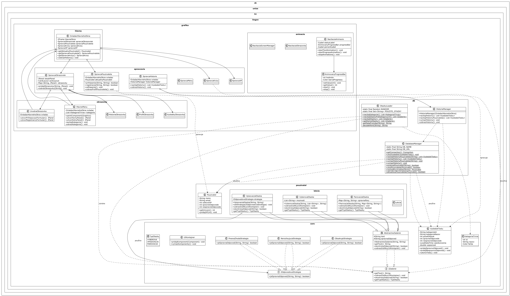

# Dokumentácia projektu Lingon

## Obsah
1. [Úvod a popis projektu](#úvod-a-popis-projektu)
2. [Štruktúra projektu](#štruktúra-projektu)
3. [Funkcionality](#funkcionality)
4. [Objektová štruktúra a architektúra](#objektová-štruktúra-a-architektúra)
5. [Polymorfizmus v projekte](#polymorfizmus-v-projekte)
6. [Práca s databázou](#práca-s-databázou)
7. [Grafické rozhranie](#grafické-rozhranie)
8. [UML diagramy](#uml-diagramy)
9. [Návod na použitie](#návod-na-použitie)
10. [Systémové požiadavky](#systémové-požiadavky)
11. [Zdroje a inšpirácie](#zdroje-a-inšpirácie)

## Úvod a popis projektu

Lingon je vzdelávacia aplikácia vytvorená v jazyku Java s využitím knižnice Swing pre grafické rozhranie. Aplikácia slúži na testovanie znalostí používateľov formou kvízov z rôznych kategórií. Projekt bol vyvinutý ako semestrálna práca pre predmet Informatika 2 na Fakulte riadenia a informatiky Žilinskej univerzity v Žiline.

Hlavným cieľom aplikácie je poskytnúť interaktívny spôsob učenia sa a testovania vedomostí. Aplikácia ponúka rôzne typy otázok (výberové, vpisovacie a párovacie), kategórie otázok, systém bodov a úrovní pre motiváciu používateľov, a sledovanie histórie testov.

## Štruktúra projektu

Projekt je rozdelený do viacerých balíkov (packages) pre lepšiu organizáciu kódu:

### Balík `sk.uniza.fri.lingon.core`
Obsahuje základné triedy a rozhrania, ktoré definujú základ aplikácie:
- `IZadanie` - rozhranie pre všetky typy otázok
- `AbstractneZadanie` - abstraktná trieda implementujúca základnú funkcionalitu otázok
- `IOdpovedovaStrategia` - rozhranie pre stratégie kontroly odpovedí
- `PresnaZhodaStrategia`, `ObsahujeStrategia`, `NerozlisujucaStrategia` - implementácie stratégií
- `KategoriaTrivia` - reprezentácia kategórie testu
- `VysledokTestu` - reprezentácia výsledku testu
- `UIKontajner` - wrapper pre manipuláciu s komponentami UI

### Balík `sk.uniza.fri.lingon.db`
Obsahuje triedy pre prácu s databázou a získavanie otázok:
- `DatabaseManager` - správa SQLite databázy pre históriu testov
- `HistoriaManager` - správa histórie testov používateľa
- `OtazkyLoader` - načítavanie otázok z API alebo lokálnych zdrojov

### Balík `sk.uniza.fri.lingon.grafika`
Obsahuje triedy pre grafické rozhranie aplikácie, rozdelené do podbalíkov:
- `animacie` - animácie pre grafické rozhranie
- `hlavny` - hlavné ovládače aplikácie
- `komponenty` - vlastné grafické komponenty
- `obrazovky` - obrazovky aplikácie
- `spravcovia` - správcovia rôznych častí aplikácie

### Balík `sk.uniza.fri.lingon.pouzivatel`
Obsahuje triedy súvisiace s používateľom:
- `Pouzivatel` - reprezentácia používateľa
- `lekcia` - typy otázok (VyberovaOtazka, VpisovaciaOtazka, ParovaciaOtazka)

## Funkcionality

Aplikácia Lingon poskytuje nasledujúce funkcionality:

### Správa používateľov
- Registrácia nových používateľov
- Prihlásenie existujúcich používateľov
- Profil používateľa s informáciami o úrovni a XP
- Systém úrovní a XP bodov za správne odpovede

### Kvízy a testy
- Rôzne kategórie testov
- Systém odomykania kategórií na základe úrovne používateľa
- Tri typy otázok: výberové, vpisovacie a párovacie
- Rôzne stratégie kontroly odpovedí

### História a štatistiky
- Uchovávanie histórie testov
- Zobrazenie výsledkov testov
- Štatistiky úspešnosti používateľa

### Online funkcionalita
- Načítavanie otázok z online API (Open Trivia Database)
- Záložný režim s lokálnymi otázkami v prípade nedostupnosti API

## Objektová štruktúra a architektúra

Projekt je navrhnutý s ohľadom na základné princípy objektovo orientovaného programovania:

### MVC architektúra
- **Model**: Triedy v balíkoch `core`, `db` a `pouzivatel`
- **View**: Triedy v balíku `grafika.obrazovky`
- **Controller**: Triedy v balíkoch `grafika.spravcovia` a `grafika.hlavny`

### Návrhové vzory
1. **Strategy Pattern** - využitý v `IOdpovedovaStrategia` pre rôzne metódy kontroly odpovedí
2. **Template Method** - využitý v `AbstractneZadanie`
3. **Factory Method** - využitý v `OtazkyLoader` pre vytváranie rôznych typov otázok
4. **Singleton** - využitý v `DatabaseManager` pre prístup k databáze

## Polymorfizmus v projekte

V projekte Lingon demonštrujem polymorfizmus nasledujúcimi spôsobmi:

### 1. Rozhranie IZadanie
Rozhranie `IZadanie` definuje spoločné správanie pre všetky typy otázok. Každá otázka musí implementovať metódy:
- `getText()` - vráti text otázky
- `zobrazGrafiku(UIKontajner kontajner)` - zobrazí grafické rozhranie otázky
- `skontrolujOdpoved(String vstup)` - skontroluje odpoveď používateľa
- `getTypOtazky()` - vráti typ otázky

### 2. Abstraktná trieda AbstractneZadanie
Abstraktná trieda `AbstractneZadanie` implementuje rozhranie `IZadanie` a poskytuje základnú funkcionalitu spoločnú pre všetky typy otázok:
- Spravuje text otázky
- Uchováva správnu odpoveď
- Poskytuje základnú implementáciu pre `skontrolujOdpoved()`
- Deklaruje abstraktnú metódu `zobrazGrafiku()`, ktorú musia implementovať podtriedy

### 3. Konkrétne implementácie otázok
V projekte mám tri rôzne typy otázok, každá s vlastnou implementáciou:
- `VyberovaOtazka` - otázka s výberom z viacerých možností
- `VpisovaciaOtazka` - otázka s textovým vstupom
- `ParovaciaOtazka` - otázka s párovaním pojmov

### 4. Vlastný systém stratégií kontroly odpovedí
Navrhol som vlastný systém rôznych stratégií kontroly odpovedí pomocou rozhrania `IOdpovedovaStrategia`, ktoré umožňuje dynamicky meniť spôsob kontroly odpovedí:
- `PresnaZhodaStrategia` - kontroluje presné zhody odpovedí
- `ObsahujeStrategia` - kontroluje, či odpoveď obsahuje očakávaný text
- `NerozlisujucaStrategia` - ignoruje veľkosť písmen pri kontrole

## Práca s databázou

Aplikácia využíva SQLite databázu pre ukladanie informácií:

### Tabuľky
1. **historia** - uchováva históriu testov
    - id, pouzivatel_email, kategoria_nazov, cas_ukoncenia, pocet_otazok, spravne_odpovede, nespravne_odpovede, uspesnost

2. **pouzivatelia** - uchováva informácie o používateľoch
    - id, meno, email, celkove_xp, spravne_odpovede, nespravne_odpovede

### Trieda DatabaseManager
Poskytuje metódy pre:
- Vytvorenie tabuliek
- Uloženie výsledku testu
- Načítanie histórie testov
- Správu používateľov (uloženie, načítanie, aktualizácia)

## Grafické rozhranie

Grafické rozhranie aplikácie je vytvorené pomocou knižnice Swing a rozdelené do viacerých obrazoviek:

### UvodnaObrazovka
- Prihlasovací formulár
- Registračný formulár
- Úvodné animácie

### HlavneMenu
- Zobrazenie kategórií testov
- Profil používateľa
- Prístup k histórii testov

### ProfilObrazovka
- Zobrazenie informácií o používateľovi
- Štatistiky úspešnosti
- Aktuálna úroveň a XP

### VysledkyObrazovka
- Zobrazenie výsledkov testu
- Počet správnych a nesprávnych odpovedí
- Získané XP

### HistoriaObrazovka
- Zoznam absolvovaných testov
- Filtrovanie podľa kategórie
- Možnosť vymazania histórie

## UML diagramy

Pre lepšie pochopenie architektúry projektu boli vytvorené nasledujúce UML diagramy:

1. **Hlavná štruktúra** - zachytáva celkovú štruktúru projektu
2. **Polymorfizmus** - zobrazuje polymorfné vzťahy medzi triedami
3. **Databáza** - znázorňuje triedy pre prácu s databázou
4. **GUI** - zobrazuje štruktúru grafického rozhrania

## Návod na použitie

### Spustenie aplikácie
1. Stiahnite si JAR súbor aplikácie
2. Uistite sa, že máte nainštalovanú Javu (JRE 11 alebo novšiu)
3. Spustite aplikáciu príkazom `java -jar Lingon.jar`

### Registrácia a prihlásenie
1. Na úvodnej obrazovke vyplňte formulár pre registráciu
2. Po úspešnej registrácii sa prihláste pomocou emailu

### Výber kategórie a absolvovanie testu
1. V hlavnom menu vyberte kategóriu testu
2. Postupne odpovedajte na otázky
3. Po dokončení testu sa zobrazí výsledková obrazovka s dosiahnutým skóre

### Prezeranie histórie
1. V hlavnom menu kliknite na tlačidlo "História testov"
2. Prezrite si svoje predchádzajúce testy a dosiahnuté výsledky

## Systémové požiadavky

### Minimálne požiadavky
- Java Runtime Environment (JRE) 11 alebo novšia
- 100 MB voľného miesta na disku
- 2 GB RAM
- Pripojenie k internetu (pre online otázky)

### Odporúčané požiadavky
- Java Runtime Environment (JRE) 17 alebo novšia
- 200 MB voľného miesta na disku
- 4 GB RAM
- Stabilné pripojenie k internetu

## Zdroje a inšpirácie

### Technické zdroje
- [SQLite JDBC Driver](https://github.com/xerial/sqlite-jdbc) - použitý pre pripojenie k databáze
- [Open Trivia Database API](https://opentdb.com/) - zdroj otázok pre kvízy
- [Tutorial: Java Swing UI Design](https://www.youtube.com/watch?v=5o3fMLPY7qY) - inšpirácia pre dizajn UI
- [Modern Java Swing UI Components](https://www.youtube.com/watch?v=He-1O8Pa4SE&list=PLlGZc17KPrVCGRKtgbdvnGshN8AePlqpd) - inšpirácia pre moderné komponenty
- [Animated Progress Bar in Java](https://www.youtube.com/watch?v=JEI-fcfnFkc) - návod pre animovaný progress bar

### Vizuálne zdroje
- [FlatLaf Look and Feel](https://www.formdev.com/flatlaf/) - inšpirácia pre moderný vzhľad
- [Java Swing Gradients Tutorial](https://www.youtube.com/watch?v=k_AdBjWzmvs) - návod pre prácu s gradientmi
- [Swing Animation Techniques](https://www.youtube.com/watch?v=j7j5ZHiF8wU) - techniky animácií v Swing

### Architektonické zdroje
- [MVC Pattern in Java](https://www.tutorialspoint.com/design_pattern/mvc_pattern.htm) - implementácia MVC
- [Strategy Pattern Example](https://www.youtube.com/watch?v=v9ejT8FO-7I) - inšpirácia pre implementáciu stratégií
- [Java Design Patterns](https://www.youtube.com/watch?v=FLmBqI3IKMA) - prehľad návrhových vzorov

---

*Dokumentácia bola vytvorená Maksymom Chernikovym pre semestrálnu prácu z predmetu Informatika 2 na FRI UNIZA, 2025.*